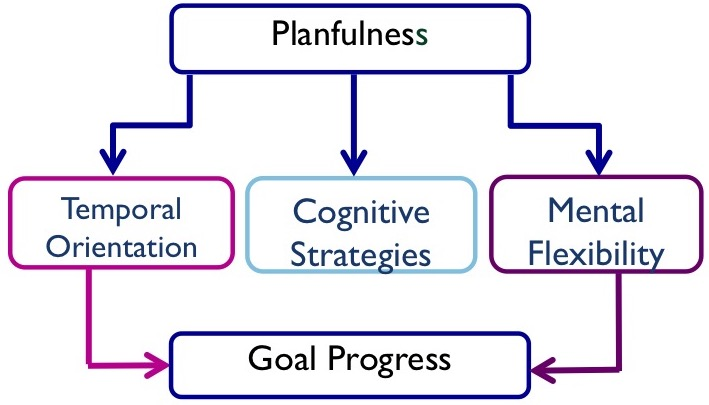

The Planfulness Scale <a href="http://doi.org/10.1525/collabra.136" target="_blank"> (Ludwig, Srivastava, & Berkman, 2018)</a> is a 30-item measure that assesses the tendency for people to exhibit patterns of thoughts about goals that have been shown to encourage goal achievement in laboratory research. It weaves together previous work from achievement and personality psychology to provide an easily distributed metric of whether people tend to use evidence-backed goal-encouraging habits.

The original aim of developing this scale was to inform intervention research. We began with the broad question of, "how can we help people achieve their goals?", with an eye turned specifically turned toward challenging, consequential life goals such as quitting an addiction. We knew that we weren't the first ones to ask this question, and so we turned to the vast literature on achievement to figure out where to start. 
  
  <blockquote style="text-align:center;background-color:black;color:white;font-family:serif;font-size:200%;"><i>"How can we help people achieve their goals?"</i></blockquote>
  
One thing was clear from our literature review: some things just seemed to work. Things like focusing on the future consequences of one's current actions, trying to automate goal-encouraging behaviors by linking them to everyday activities, or taking the time to reflect on how much work there is still to be done to reach a goal- and how good it will feel once that goal is achieved. But many of these tactics were taught in a laboratory to participants, and there were no follow-ups to see if these participants continued to use these tactics with success in the real world. This lead us naturally to a different question which formed the basis for developing the Planfulnes Scale- are there people who tend to use these tactics in the real world, and are they indeed more successful at achieving their goals? 

To answer this question we began the long process of scale development and validation (for full details, see <a href="http://doi.org/10.1525/collabra.136" target="_blank"> Ludwig, Srivastava, & Berkman, 2018</a>). We began by hypothesizing a model of the planfulness construct- how we expected different items on our scale to relate to each other and the behaviors that we were going to observed. Based on our literature review we specifically hypothesized that Planfulness had three subscales to reflect the three general categories of effective goal achievement strategies:

<b><u>Temporal Orientation (TO)</u></b> - Whether one is biased towards the present or the future when making decisions. Those high in planfulness are future-oriented, thinking about their long-term goals instead of short-term rewards.

<b><u>Cognitive Strategies (CS)</u></b> - Whether one uses specific techniques to help achieve their goals. Those high in planfulness set particular plans of action to achieve their goals, rather than just winging it.

<b><u>Mental Flexibility (MF)</u></b> - Whether one is flexible in their thinking, allowing them to fluidly move from thoughts about the idealized goal state to the present reality. Those high in planfulness are able to recover from any present obstacles and clearly see behavior in the context of progress toward their goal.

The below figure is a model of our hypothesized structure, which shows how we believe the superordinate concept of Planfulness explains the variation in the tendency to use goal-encouraging processes in each of the three subordinate general categories, and how these processes in turn encourage goal progress.

Once we developed the scale by asking hundreds of people to take different versions, we next wanted to test its construct validity- the degree to which the scale measures what we think it does. To do this, we asked over 1,00 people to write down three projects that they wanted to make progress on in the coming months. We also asked them to rate on a scale of 0-100% what percentage of the projects were already completed, and to take the Planfulness Scale. Three months later we asked them to do the same thing- so that we could see if scores on the Planfulness Scale were related to goal progress over time. 

The result? Planfulness was positively associated with goal progress. Put simply, we observed that the higher the score on the Planfulness Scale, the more likely that participants were to make progress on their goals throughout the three months. In fact, for each score point increase on the scale, participants made on average 12% more progress towards achieving their goals.

  <blockquote style="text-align:center;background-color:black;color:white;font-family:serif;font-size:200%;"><i>"We observed that the higher the score on the Planfulness Scale, the more likely that participants were to make progress on their goals."</i></blockquote>
  
This was the first step in testing the construct validity of the scale. But we still have more work to do in the future! First, we would like to better understand how planfulness fits in with other related psychological constructs, such as conscientiousness, grit, and mindfulness. This is an important part of the process as it helps us figure out the unique value of the Planfulness Scale, and what behavior our scale is better at predicting than those other closely related measures.

We also need to test the ability of the Planfulness Scale to relate to outcomes that are <i>not</i> self-report- that is, outcomes that we can measure objectively, without relying on participants to report on their own progress. And this is exactly what we are doing now! Soon we will be able to share the results from a study in collaboration with the University of Oregon Student Recreation Center on fitness goals. 
